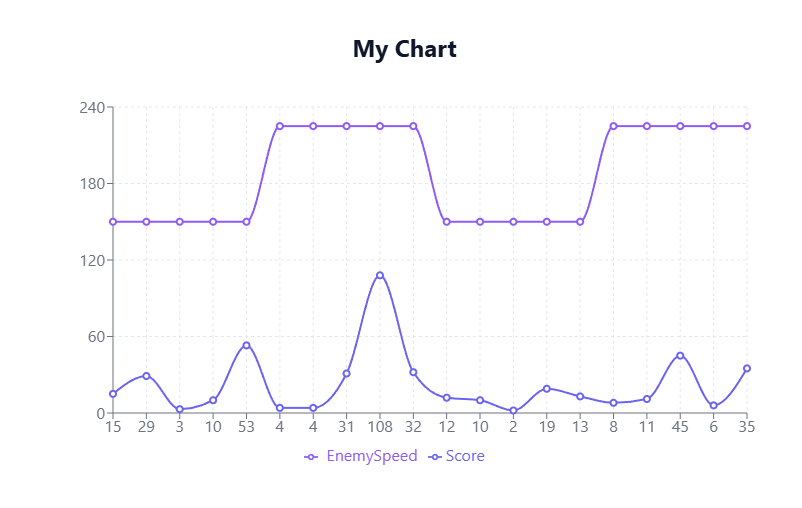

# 1: Dodge The Creeps
* Surviving - Core Mechanic
* Loss upon death - collision

Top down where players avoid enemies. Enemies spawn with a timer and get removed upon leaving the screen.

# 2: Experimental Design

### (i) Question:
Does increasing the enemy speed make the game too hard?

### (ii) Variables
* Independant Variables:
 * Enemy speed
* Dependant Variables:
 * Score/Survival Time 

### (iii) HypothesisResultGraph
If we change enemy speed by 50% then the survival rate of the player is expected to be decreased also by roughly 50% in correlation, beacuse the enemies
should be overhelming the player in a small area.

# 3: Conditions & Controls
### (i) Experimental Conditions
* Condition A: Enemy Speed 150
* Condition B: Enemy Speed 225

### (ii) Controls
* W,A,S,D to move
* Instruction: Dodge the enemies
* Player aims to survive as long as possible

# 4: Implementation in Godot
## Data logging
We made a ScoreManager.gd file to create and write to the .csv file. It stores the data as follows

### Required Fields
Player | Score | EnemySpeed             -> Following our experimental design

# 5: Data Collection
Jonathan and Edward ran the both conditions individually 5 times for a total of 20 tests.
10 tests for Condition A. 10 tests for Condition B

Player	Score	EnemySpeed
Jonathan
Player	15	    150
Player	29	    150
Player	3	    150
Player	10	    150
Player	53	    150
Player	4	    225
Player	4	    225
Player	31	    225
Player	108	    225
Player	32	    225 

Edward
Player	12	    150
Player	10	    150
Player	2	    150
Player	19	    150
Player	13	    150
Player	8	    225
Player	11	    225
Player	45	    225
Player	6	    225
Player	35	    225

# 6: Analysis

|Conditions |A         |B            |
|-----------|----------|-------------|
|Enemy Speed|150       |225          |
|TTL        |Mean: 17  |Mean: 28     |
|           |Median: 13| Median: 21  |

# 7: Design Decision

Our chosen value was enemy speed.

Our hypothesis is not backed by the results.
Overall the player survived longer by 65%. This was an unexpected result. Due to this result Condition A will remain the same to 
keep the game difficult.